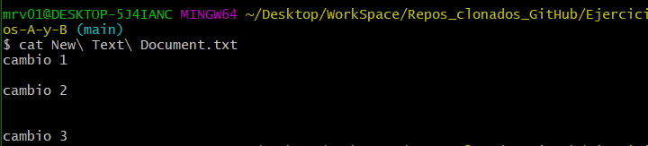
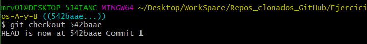
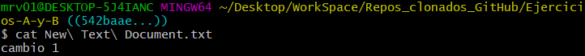
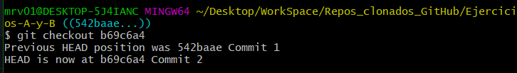
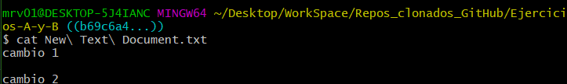
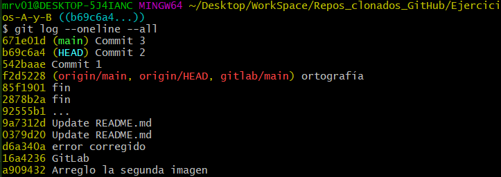
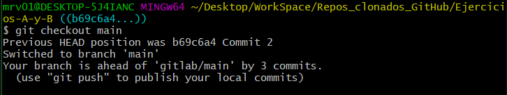
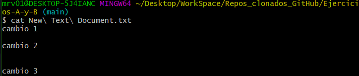
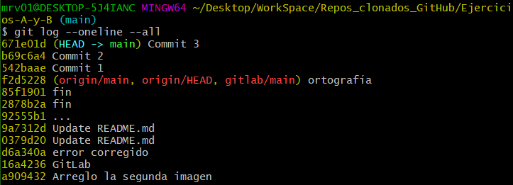

# Práctica_2:

# Paso#1:

Ejecutamos el comando ```git log --oneline --all``` para listar todos los commits de nuetro proyecto.


Nos aparecerá la lista con nuestros commits, a la izquierda tendremos el hash de cada commit , a la derecha el nombre de cada commit y lo que aparece entre paréntesis ```(HEAD -> main) Commit 3```, HEAD apunta por defecto al último commit que realizamos pero podemos movernos a través de los commits usando el comando ```git checkout hash_del_commit``` y main es el nombre de la rama en la que me encuentro en esos momentos.

# Paso#2 :

Ejecutamos el comando ```cat nombre_del_txt``` para ver el contenido del archivo txt en el commit que nos encontramos.




# Paso#3 :

Ejecutamos el comando ```git checkout hash_del_commit``` para movernos a otro commit.




# Paso#4 :

Ejecutamos nuevamente el comando ```cat nombre_del_txt``` para ver el contenido en el commit actual.



# Paso#5 :

Ejecutamos el comando ```git log --oneline --all``` para ver donde nos encontramos.


Vemos que nos encontramos en el commit 1.

# Paso#6 :

Volvemos a ejecutar el comando ```git checkout hash_del_commit``` para movernos a otro commit.




# Paso#7 :

Volvemos a ejecutar el comando ```cat nombre_del_txt``` para visualizar su contenido.




# Paso#8 :

Ejecutamos nuevamente el comando ```git log --oneline --all``` para ver donde nos encontramos.



Como podemos observar nos encontramos en el commit 2.

# Paso#9 :

Ejecutamos el comando ```git checkout nombre_rama_principal``` para movernos al inicio del todo y poder continuar nuestro proyecto desde donde lo dejamos. 



# Paso#10 :

Volvemos a ejecutar el comando ```cat nombre_del_txt``` para visualizar su contenido.



# Paso#11 :

Ejecutamos nuevamente el comando ```git log --oneline --all``` para ver donde nos encontramos.



Como podemos observar nos encontramos de vuelta en el ultimo commit realizado.


```Ejercicio completado```
